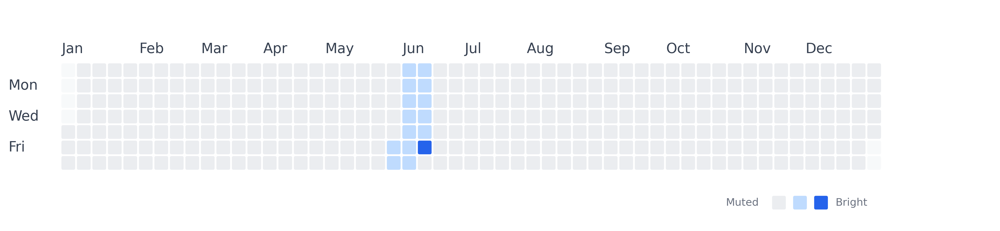

# Contribution Grid Visualization

A Python script that generates a **GitHub-style contribution grid** for the year **2026**, designed as a visual element for a research group meeting presentation cover.

## Preview



The grid visualizes a "2026 research footprint" with a clean, minimalist aesthetic:
- **Vivid blue** — the meeting day (June 12, 2026)
- **Soft blue** — the two weeks leading up to the meeting
- **Light gray** — all other days of 2026
- **Nearly transparent** — days outside 2026 (padding on either side to complete the 7×53 week grid)

## Usage

```bash
python render.py
```

This produces two files in the current directory:
- `contribution_grid.svg` — scalable vector, suitable for placing directly into slides
- `contribution_grid.png` — raster preview at 300 DPI

## Customization

Open [render.py](render.py) and adjust the values at the top of the script:

| Parameter       | Description                                   | Default                       |
|-----------------|-----------------------------------------------|-------------------------------|
| `YEAR`          | The year the grid represents                  | `2026`                        |
| `MEETING_DATE`  | The highlighted meeting day                   | `datetime.date(2026, 6, 12)`  |
| `PAST_DAYS`     | Number of days before the meeting to highlight| `14`                          |

## Dependencies

- Python 3.7+
- [matplotlib](https://matplotlib.org/) (`pip install matplotlib`)

## License

MIT